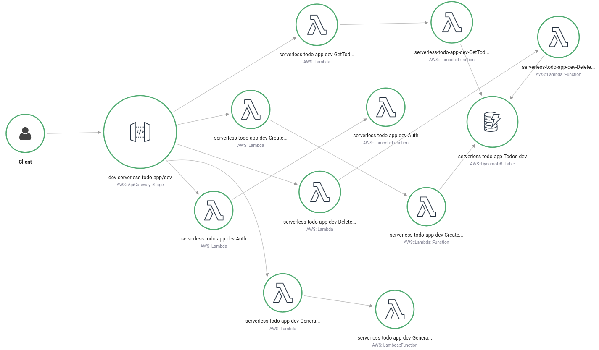

# ToDo - Tasks list management

A TO-DO application built with [Serverless framework](https://www.serverless.com/) and running on AWS Serverless platform.

## Functionality of the application

* This application allows creating/removing/updating/fetching TODO items.
* Each TODO item can optionally have an attachment image.
* Each user only has access to TODO items that he/she has created.

## Service Map



## TODO items

The application stores TODO items, and each TODO item contains the following fields:

* `todoId` (string) - a unique id for an item
* `createdAt` (string) - date and time when an item was created
* `name` (string) - name of a TODO item (e.g. "Change a light bulb")
* `dueDate` (string) - date and time by which an item should be completed
* `done` (boolean) - true if an item was completed, false otherwise
* `attachmentUrl` (string) (optional) - a URL pointing to an image attached to a TODO item

## Getting Started

## Prerequisites

* Opened [AWS](https://aws.amazon.com/) account
* [_npm_](https://nodejs.org/en/) installed
* [_Serverless_](https://www.serverless.com/framework/docs/getting-started/) installed

### Authentication

To enable authentication in the application, you will have to create an [Auth0](https://auth0.com/) application and copy "domain" and "client id" to the `config.ts` file in the `client` folder.
We recommend using asymmetrically encrypted JWT tokens.

### Backend

To deploy the backend run the following commands:

```bash
cd backend
npm install
serverless deploy -v
```

### Frontend

To run the client application first edit the `client/src/config.ts` file to set correct parameters.
And then run the following commands:

```bash
cd client
npm install
npm run start
```

This will start a development server with the React application that will interact with the serverless TODO application.


### Postman collection

An alternative way to test your API, you can use the Postman collection that contains sample requests.
You can find a [Postman collection](project4-todo-app-serverless.postman_collection.json) in this project.
To import this collection, do the following.

Click on the import button:


Click on the "Choose Files":


Select a file to import:


Right click on the imported collection to set variables for the collection:


Provide variables for the collection (similarly to how this was done in the course):


